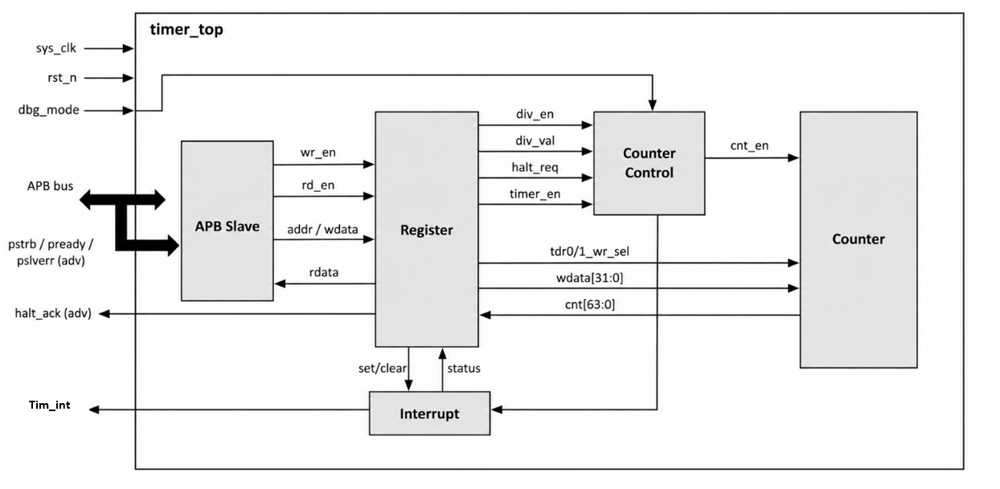

# Timer IP — 64-bit APB Timer

A 64-bit hardware Timer IP with APB slave interface, programmable clock divider, maskable interrupt, and debug halt support. Designed and verified from scratch in Verilog-2001.

> Inspired by the [CLINT module of RISC-V Chromite M SoC](https://chromitem-soc.readthedocs.io/en/latest/clint.html)

---

## Block Diagram



---

## Features

- **64-bit count-up counter** — presented as two 32-bit registers (`TDR0` lower, `TDR1` upper)
- **APB slave interface** — 12-bit address, 32-bit data, active-low async reset, 1 wait state, `pslverr` error response
- **Programmable clock divider** — `div_val` ∈ {0..8} divides system clock by 1, 2, 4, 8, 16, 32, 64, 128, or 256
- **Byte-write strobe** — `tim_pstrb[3:0]` enables per-byte writes to any register
- **Maskable level interrupt** — `int_st` pending bit set on compare match, `tim_int = int_en & int_st`, RW1C clear
- **Hardware auto-clear** — counter resets to 0 when `timer_en` goes High→Low
- **Debug halt mode** — `dbg_mode & halt_reg` freezes counter; `halt_ack` confirms halt; resumes seamlessly on release
- **Error response** — `pslverr` on illegal `div_val > 8` or changing `div_en`/`div_val` while timer is running

---

## Interface Signals

| Signal | Width | Dir | Description |
|---|---|---|---|
| `sys_clk` | 1 | In | System clock |
| `sys_rst_n` | 1 | In | Active-low asynchronous reset |
| `tim_psel` | 1 | In | APB select |
| `tim_pwrite` | 1 | In | APB write enable |
| `tim_penable` | 1 | In | APB enable (ACCESS phase) |
| `tim_paddr[11:0]` | 12 | In | APB address |
| `tim_pwdata[31:0]` | 32 | In | APB write data |
| `tim_pstrb[3:0]` | 4 | In | Byte write strobe |
| `tim_prdata[31:0]` | 32 | Out | APB read data |
| `tim_pready` | 1 | Out | APB ready (wait state) |
| `tim_pslverr` | 1 | Out | APB slave error |
| `tim_int` | 1 | Out | Timer interrupt (level, maskable) |
| `dbg_mode` | 1 | In | Debug mode enable |

---

## Register Map

| Offset | Name | Reset | Description |
|---|---|---|---|
| `0x00` | TCR | `0x0000_0100` | Timer Control — `div_val[11:8]`, `div_en[1]`, `timer_en[0]` |
| `0x04` | TDR0 | `0x0000_0000` | Counter value [31:0] |
| `0x08` | TDR1 | `0x0000_0000` | Counter value [63:32] |
| `0x0C` | TCMP0 | `0xFFFF_FFFF` | Compare value [31:0] |
| `0x10` | TCMP1 | `0xFFFF_FFFF` | Compare value [63:32] |
| `0x14` | TIER | `0x0000_0000` | Interrupt enable — `int_en[0]` |
| `0x18` | TISR | `0x0000_0000` | Interrupt status — `int_st[0]` (RW1C) |
| `0x1C` | THCSR | `0x0000_0000` | Halt control — `halt_reg[0]` W, `halt_ack[1]` R |
| Others | — | — | Reserved (RAZ/WI) |

---

## Project Structure

```
Timer_IP_64bit/
├── rtl/                    RTL source (Verilog-2001)
│   ├── timer_top.v         Top-level
│   ├── apb_slave.v         APB slave FSM
│   ├── register.v          Register file
│   ├── cnt_ctrl.v          Clock divider & counter control
│   ├── counter.v           64-bit counter
│   └── interrupt.v         Interrupt logic
├── tb/
│   └── test_bench.v        Testbench
├── testcases/              13 directed testcase files
├── sim/
│   ├── Makefile            Simulation flow
│   ├── pat.list            Testcase list
│   ├── report.csh          PASS/FAIL report
│   └── run_all_cov.sh      Run all + coverage
├── docs/
│   ├── Timer_Design_Specification_Template.pdf
│   └── Timer_IP_Verification_Plan.xlsx
└── waveform/               Simulation waveform screenshots
```

---

## Simulation

### Requirements
- Questa Intel FPGA Edition (`vlog` / `vsim` / `vcover`) — tested on v2024.3

### Run a single testcase
```bash
cd sim
make TESTNAME=interrupt_chk all
```

### Run all 13 testcases + coverage report
```bash
cd sim
bash run_all_cov.sh
```

### View results
```bash
./report.csh                        # PASS/FAIL table
vi coverage/summary_report.txt      # coverage summary
```

### Make targets

| Target | Description |
|---|---|
| `make all` | Build + run simulation |
| `make all_cov` | Build + run with coverage |
| `make gen_cov` | Merge `.ucdb` + apply exclusions + generate reports |
| `make wave` | Open waveform viewer |
| `make clean` | Remove compiled artifacts |

---

<a id="author"></a>
<h2><strong>👨‍💻 Author</strong></h2>
<table>
  <tr>
    <td colspan="3" align="center">
      <br>
      <h2>⚡ Hoàng Ngọc Gia Bão</h2>
      <p><b>Integrated Circuit Design · FPT University</b></p>
      <br>
      <p><b>📬 Connect with me</b></p>
    </td>
  </tr>
  <tr>
    <td align="center" width="300">
      <br>
      <a href="mailto:baohoang037@gmail.com"></a>
      <p><a href="mailto:baohoang037@gmail.com">baohoang037@gmail.com</a></p>
    </td>
    <td align="center" width="300">
      <br>
      <a href="https://www.linkedin.com/in/hoang-ngoc-gia-bao-883124235/"></a>
      <p><a href="https://www.linkedin.com/in/hoang-ngoc-gia-bao-883124235/">View professional profile ↗</a></p>
    </td>
    <td align="center" width="300">
      <br>
      <a href="https://github.com/baohoang037"></a>
      <p><a href="https://github.com/baohoang037">@baohoang037 ↗</a></p>
    </td>
  </tr>
</table>
